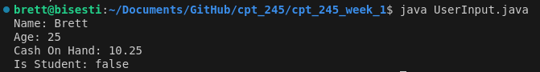

# Weekly Assignment Instructions

### Overview
This assignment will provide an introduction to Java, data types, and syntax!

### Learning Outcomes
By the end of this assignment, you should be able to:
- Run the basic "Hello World" command in Java
- Create several variables using various data types
- Perform basic arithmetic using variables of appropriate types

### Instructions
1. **Read the following materials**:
   - [W3Schools Java](https://www.w3schools.com/java/default.asp) 
    Please read "Java HOME" through "JAVA Booleans"
   - [Java Installation](https://bell-sw.com/pages/downloads/#jdk-21-lts)
     Please install Java version 21 from this website!  All you need to do is download the ".deb" from the website and run it!
   
2. **Complete the following tasks**:

    - HelloWorld.java
    
    Please open the Terminal and run "java HelloWorld.java" in this directory.
    You should see "Hello, World!" displayed on the screen

    - DataTypes.java 
    
    Next, please open the "DataTypes.java" file in this directory and fix all of the errors.  You will know you have completed this task when you are able to run the command "java DataTypes.java" in the terminal and get the following output

    

    - TemperatureConverter.java

    Next, please complete the program between #### ASSIGNMENT STARTS/ENDS HERE #### comments to convert the given degrees in fahrenheit to celsius.

4. **Please commit your code to a public GitHub repository**
    - Once you have completed all three tasks in your code please commit your updated code to a public repository in your account on GitHub!
    - Once you have a public repository link submit that link to the week one assignment in Brightspace!
